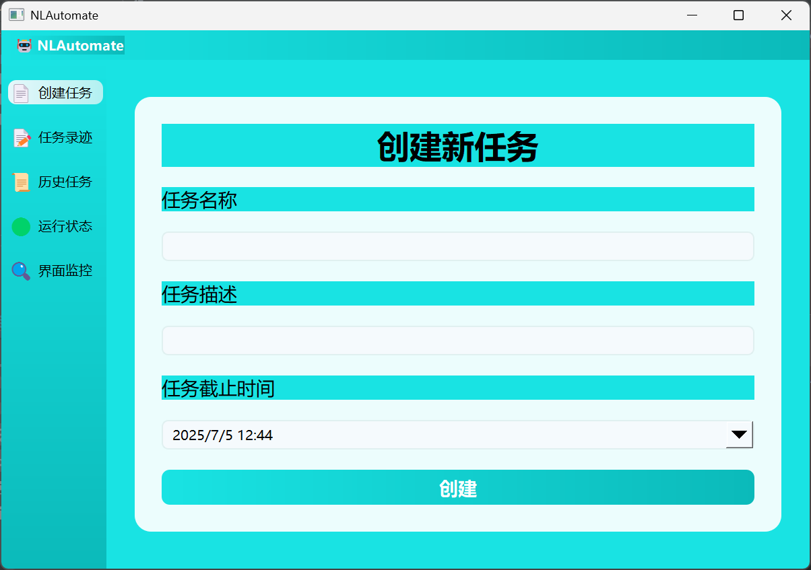
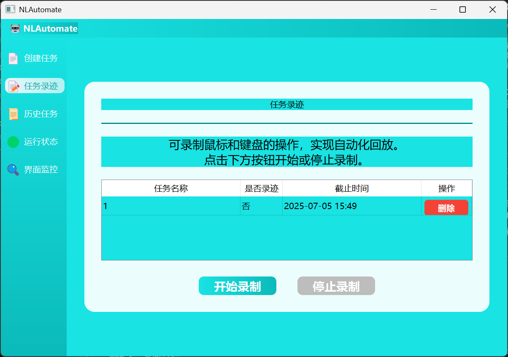
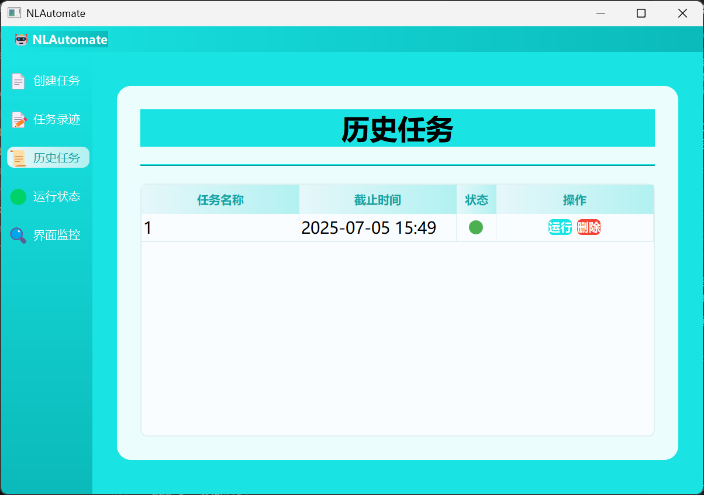
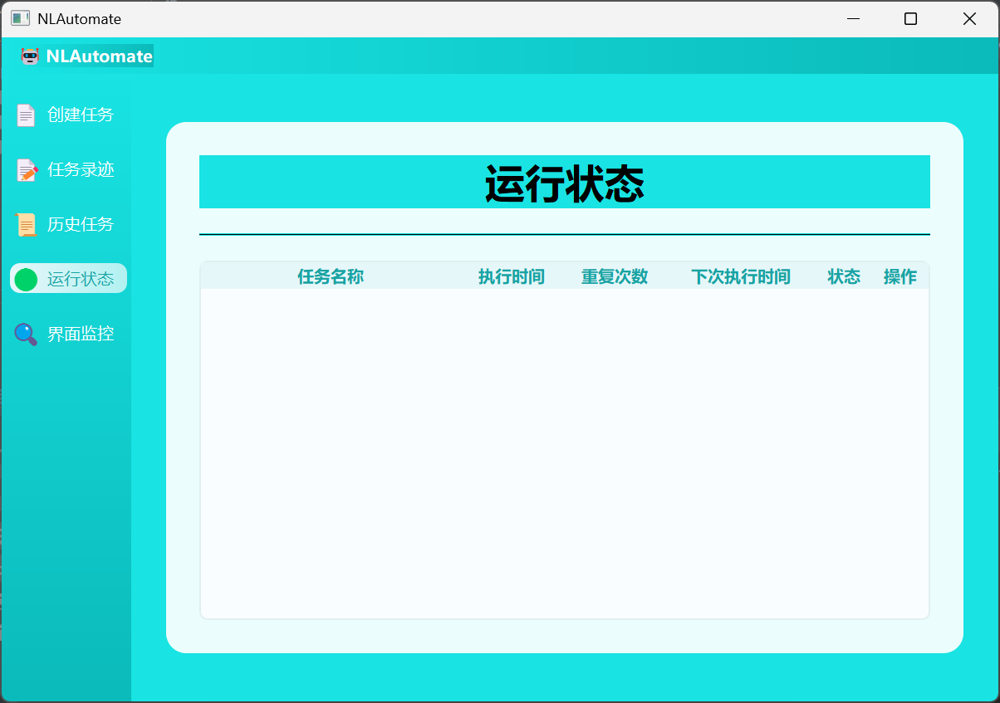
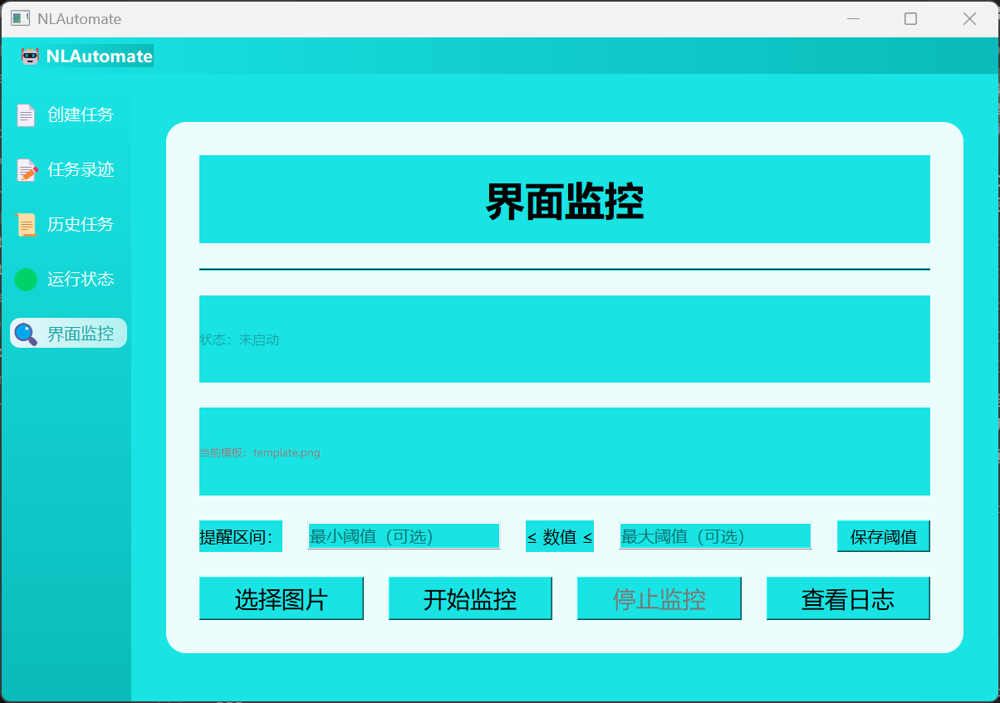

# Automate 项目使用说明

## 一、项目简介

Automate 是一款基于 PyQt5 的自动化任务管理与界面监控工具，集成了任务录制回放、定时任务、界面数值监控、阈值提醒等多种实用功能，适用于自动化办公、界面数据监控等场景。

## 二、主要功能

### 1. 任务录制与回放
- 支持录制鼠标、键盘操作，生成自动化脚本。
- 可选择是否录制鼠标移动轨迹。
- 支持任务回放，自动执行录制的操作流程。

### 2. 历史任务管理
- 任务自动保存至历史任务列表。
- 支持任务的运行、删除等操作。
- 可设置任务的截止时间，超时任务自动禁用。

### 3. 定时任务
- 支持为历史任务设置定时自动执行。
- 可设置每天执行时间、重复次数、重复间隔（秒）。
- 支持任务的暂停、恢复、删除等操作。

### 4. 界面监控
- 支持通过模板图片自动定位界面区域，OCR识别数值。
- 可自定义监控阈值（最小值、最大值），超限自动提醒（弹窗、声音）。
- 监控日志实时查看。

### 5. 响应式美观UI
- 所有卡片、表格、按钮均自适应窗口大小，风格统一。
- 支持深色/浅色渐变背景，圆角卡片，阴影效果。

## 三、使用方法

### 1. 环境准备

- 推荐使用虚拟环境（venv/conda）。
- 安装依赖：
  ```bash
  pip install -r requirements.txt
  ```
- 项目目录需包含：
  - `Tesseract-OCR/tesseract.exe`（OCR引擎，建议放在项目根目录下的Tesseract-OCR文件夹）
  - `sounds/`（存放自定义音效文件）
  - 其它源码文件

### 2. 运行项目

- 开发环境下：
  ```bash
  python main.py
  ```

### 3. 主要操作流程

#### 任务录制与回放
1. 在"任务录迹"页面新建任务，点击"开始录制"。
2. 按提示操作，录制完成后点击"停止录制"。
3. 可选择将录制任务保存到历史任务，便于后续定时执行。

#### 历史任务与定时任务
1. 在"历史任务"页面可查看所有已保存任务。
2. 点击"运行"可设置定时执行时间、重复次数、重复间隔。
3. 任务到点后自动执行，支持暂停、恢复、删除。

#### 界面监控
1. 在"界面监控"页面选择模板图片（需提前截图）。
2. 设置监控阈值（最小/最大），选择提醒音效。
3. 点击"开始监控"，系统自动识别界面数值，超限自动提醒。
4. 可实时查看监控日志。

## 四、注意事项

1. **Tesseract-OCR路径**  
   - 项目已自动适配相对路径，无需手动修改。打包后请确保`Tesseract-OCR`文件夹与exe同级。

2. **模板图片**  
   - 监控模板图片需清晰、尺寸合适，建议用系统截图工具截取。

3. **日志与数据**  
   - 监控日志、任务数据等均保存在项目目录下，注意备份。

## 七、页面展示

本项目主要页面如下：

### 1. 创建任务
- 用于新建自动化任务，填写任务名称、描述、截止时间。
- 支持任务的基本信息录入。
- 

### 2. 任务录迹
- 支持录制鼠标、键盘操作，生成自动化脚本。
- 可选择是否录制鼠标移动轨迹。
- 

### 3. 历史任务
- 展示所有已保存任务，支持运行、删除等操作。
- 可设置任务的截止时间，超时任务自动禁用。
- 

### 4. 运行状态
- 展示所有定时任务的执行状态。
- 支持任务的暂停、恢复、删除。
- 

### 5. 界面监控
- 支持模板图片定位、OCR识别、阈值设置、音效提醒。
- 实时展示监控状态和日志。
- 

--- 
